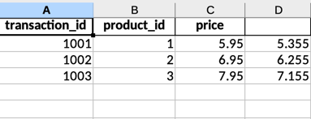
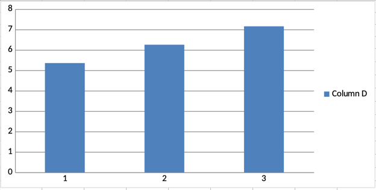

# Python Recovery Project

## Description
Python automation script for processing Excel files. The program applies a 10% discount to prices and generates a bar chart with the results.

## Snapshots




## Features
- Excel file reading
- Automatic discount application
- Bar chart generation
- Automatic changes saving

## Requirements
```bash
openpyxl==3.1.2
```

## Usage
```python
from automation.app import process_workbook

# Process an Excel file
process_workbook('file.xlsx')
```

## Installation
1. Clone the repository
```bash
git clone https://github.com/your-username/python_recovery.git
cd python_recovery
```

2. Install dependencies
```bash
pip install -r requirements.txt
```

## Project Structure
```
python_recovery/
├── automation/
│   └── app.py
├── requirements.txt
├── .gitignore
└── README.md
```

## Contributing
Pull requests are welcome. For major changes, please open an issue first to discuss what you would like to change.

## License
This project is licensed under the [MIT License](LICENSE).